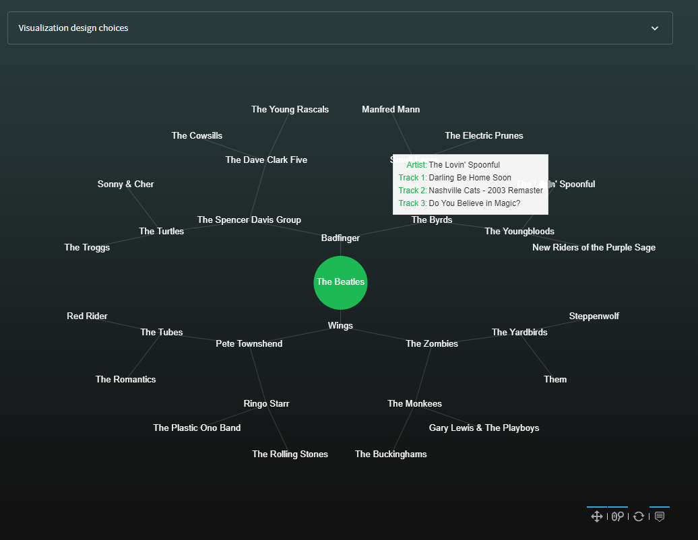
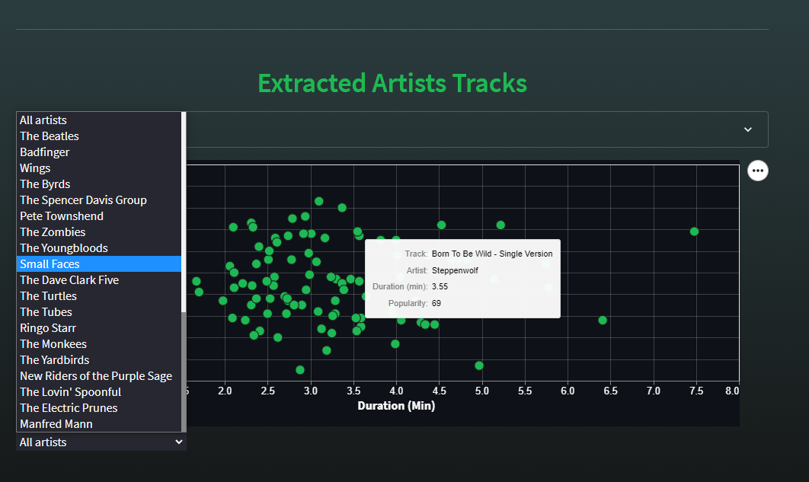

# Spotify Artists Rabbit Hole

- Retrieves songs from n artists related to other n artists and so on starting from a base artist. 
- Builds a graph with the relationship of every artist displayed within streamlit.
- Extracts most popular tracks with metadata of retrieved artists

---
## Usage

### Create data

Set environment variables
```
SPOTIFY_USERNAME
SPOTIFY_CLIENT_ID
SPOTIFY_CLIENT_SECRET
```

```bash
pip install -r requirements.txt
```

Run `create_data.py` to create the datasets
```
python api/create_data.py --artist "The Beatles" \
                          --max-artists 4 \
                          --n-related 2 \
                          --n-tracks 2 \
                          --output-dir sample_data
```

2 output files will be created inside the output directory
```
── sample_data
   ├── graph.pkl
   └── songs.csv
```

### Streamlit
##### Locally

```bash
pip install -r requirements.txt
```

Change `serverAddress` to `localhost` in `.streamlit/config.toml` if its set to `0.0.0.0`

```
streamlit run streamlit_app/app.py
```

##### Docker

Build the image
```bash
docker build -t st_rabbit_hole:latest .
```

Run the container
```bash
docker run --rm -p 8501:8501 st_rabbit_hole:latest
```

---
## Examples




